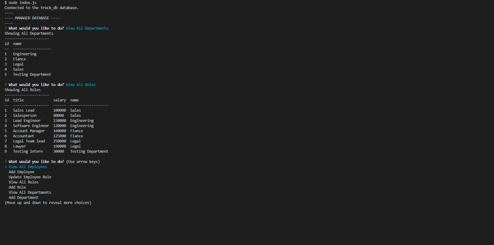

# sql-employee-tracker
Command-line app to manage an employee databse

## Description
Main Topics: MySQL, Inquirer and console.table package

This is a backend application that uses MySQL to house our database of departments, roles and employees. The application also usesInquirer to prompt our user from the terminal for what action they want to carry out. With a connection to a MySQL database we use queries to execute MySQL commands and use the console.table package to display the tables to the terminal. Please checkout of the video link for an exmaple of the application.


## Screenshot



## Link
[Video Link](https://drive.google.com/file/d/1guAU_TbVCXE1O8Rkq1wxRp8XNsRMLi-Y/view)


## Developed by:
```
John Foxwell
```


